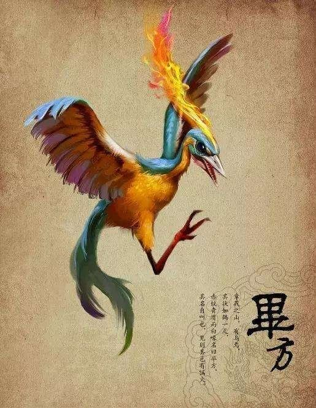

# BiFang (毕方)



## 大家好
我是毕方的作者，想维护一个Cocos Creator 组件化快速开发框架，这需要投入时间与精力。社区的活跃是作者的动力。
作者水平不高，有什么说不对的请指正。

* 做开源需要投入时间和精力，社区的活跃是作者的动力，star上10颗星，更新新内容

## 关于
BiFang是专门为Cocos Creator快速开发而生的，专注于组件化的探索。
追求极简的使用方式，对原有系统最小的侵入

## 正文

##### 组件-金币动画：[BFCoinAnim.ts](./assets/bf/BFCoinAnim.ts)


使用：
```
1.配置
     必须设置金币动画的纹理：
         1. BFCoinAnim.SetCoinTexture(cc.SpriteFrame)
         2. BFCoinAnim.SetCoinResources(string) //动态加载纹理，传入路径
     其它设置：(非必填)
         1.SetAnimCountMax(number)
         2.setAnimRotate(boolean)
2.调用
     方法1：
         new BFCoinAnim().ReadPlay(start: cc.Vec2 | cc.Node,end: cc.Vec2 | cc.Node,count)
     方法2：(推荐)
         cc.game.emit("bf-coin-add-anim",start: cc.Vec2 | cc.Node,end: cc.Vec2 | cc.Node,count)
```
用例：
```
const { ccclass, property } = cc._decorator;
@ccclass
export default class CoinAnimScene extends cc.Component {

    @property(cc.SpriteFrame)
    coinTexture: cc.SpriteFrame = null

    @property(cc.Node)
    endNode: cc.Node = null

    onLoad() {
        //初始化
        BFCoinAnim.SetCoinTexture(this.coinTexture)
        this.node.on(cc.Node.EventType.TOUCH_START, function (event: cc.Event.EventTouch) {
            //方法1
            new BFCoinAnim().ReadPlay(event.getLocation(), this.endNode, 30)
            //方法2
            // cc.game.emit("bf-coin-add-anim", event.getLocation(), this.endNode, 30)
        }.bind(this))
    }

}
```
### Cocos Creator 学习资源
+ 插件
  + [场景编辑器右键菜单插件](https://github.com/caogtaa/CCSceneMenu/tree/master)  
+ 项目
  + [贝塞尔路径编辑器](https://github.com/csdjk/BezierCurvePathCreater) 
  + [Shader Effect Demo](https://github.com/zhitaocai/CocosCreatorShaderEffectDemo) 
+ 工具
  + [TypeScript脚本解释器，微信热更新方案](https://gitee.com/jianyumofa/qyscript)

  
